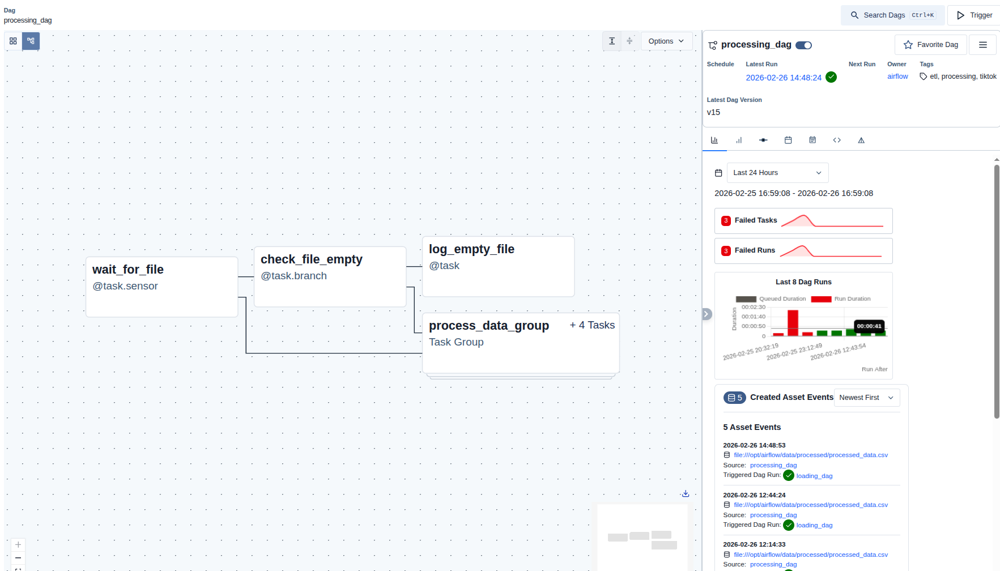
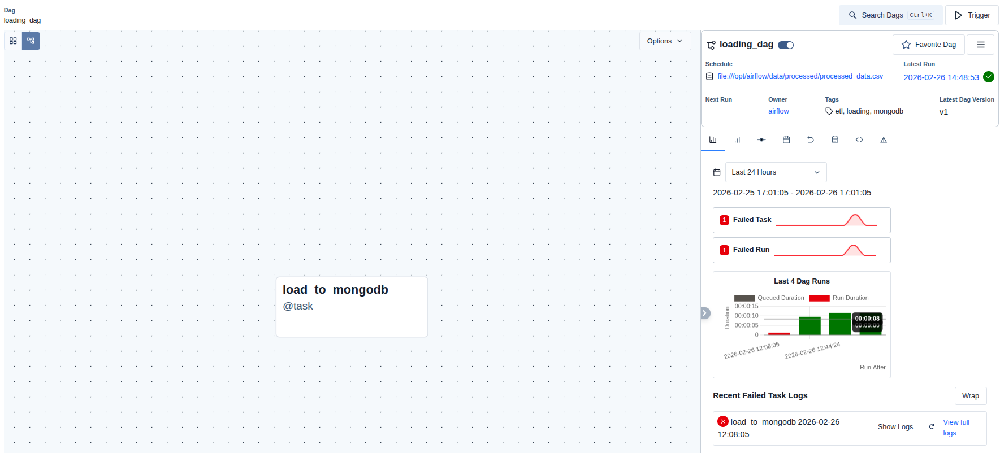

# Airflow Data Pipeline with MongoDB

ETL pipeline for processing TikTok Google Play reviews and loading into MongoDB using Apache Airflow 3.1.7.

## Architecture

```
┌─────────────────┐     Dataset      ┌─────────────────┐
│ processing_dag  │ ───────────────> │  loading_dag    │
│  (Sensor →      │  (processed     │  (MongoDB       │
│   Branch →      │   data file)    │   loader)       │
│   TaskGroup)    │                  │                 │
└─────────────────┘                  └─────────────────┘
```

## Project Structure

```
├── dags/
│   ├── processing_dag.py    # Main DAG with transformations
│   └── loading_dag.py       # Dataset-aware DAG for MongoDB loading
├── plugins/
│   └── transformations.py   # Data transformation functions
├── data/
│   ├── input/               # Source CSV files
│   └── processed/           # Transformed data output
├── docker-compose.yaml      # Airflow + MongoDB setup
├── .env                     # Environment configuration
└── pyproject.toml           # Python dependencies
```

## Technologies

- **Apache Airflow 3.1.7** — Workflow orchestration with TaskFlow API
- **MongoDB 6** — NoSQL database
- **Pandas** — Data processing
- **Docker** — Containerization

## Quick Start

### 1. Start Airflow

```bash
docker-compose up -d
```

### 2.  MongoDB Connection is created in `.env`

AIRFLOW_CONN_MONGO_DEFAULT='{"conn_type": "mongo", "host": "mongodb", "port": 27017, "login": "airflow_user", "password": "password"}'


### 3. Access Airflow UI

- URL: http://localhost:8082
- Username: `airflow`
- Password: `airflow`

### 4. Run the Pipeline

1. Trigger `processing_dag` manually
2. After completion, `loading_dag` runs automatically via Dataset scheduling
3. Check MongoDB Compass for loaded data

## DAGs

### processing_dag

**Schedule:** Manual trigger
**Dataset:** Outputs to `processed_data_asset`

| Task | Type | Description |
|------|------|-------------|
| `wait_for_file` | FileSensor | Detects input CSV appearance |
| `check_file_empty` | BranchOperator | Routes based on file size |
| `log_empty_file` | Task | Logs empty file notification |
| `process_data_group` | TaskGroup | Data transformations |

**TaskGroup: process_data_group**
- `replace_nulls` — Replace null values with "-"
- `sort_by_date` — Sort by created_date column
- `clean_content` — Remove emojis/special chars
- `save_to_dataset` — Save to CSV and update Dataset

### loading_dag

**Schedule:** `[processed_data_asset]` (Dataset-aware)
**Trigger:** Runs automatically when processing_dag updates the Dataset

| Task | Type | Description |
|------|------|-------------|
| `load_to_mongodb` | Task | Reads CSV and loads to MongoDB |

**Configuration:**
- Collection name: `MONGO_COLLECTION` env var (default: `processed_data`)
- Connection: `mongo_default`

## MongoDB Queries

Run these in MongoDB Compass or `mongosh`:

### Top 5 Most Frequent Comments

```javascript
db.processed_data.aggregate([
  { $group: { _id: "$content", count: { $sum: 1 } } },
  { $sort: { count: -1 } },
  { $limit: 5 },
  { $project: { content: "$_id", count: 1, _id: 0 } }
])
```


### Short Comments (< 5 characters)

```javascript
db.processed_data.find({
    $expr: { $lt: [{ $strLenCP: "$content" }, 5] }
})
```


### Average Rating Per Day (Timestamp)

```javascript
db.processed_data.aggregate([
  {
    $addFields: {
      date: { $dateFromString: { dateString: "$at", format: "%Y-%m-%d %H:%M:%S" } }
    }
  },
  {
    $group: {
      _id: { $dateFromParts: { year: { $year: "$date" }, month: { $month: "$date" }, day: { $dayOfMonth: "$date" } } },
      avgRating: { $avg: { $toDouble: "$score" } }
    }
  },
  { $project: { date: "$_id", avgRating: 1, _id: 0 } },
  { $sort: { date: 1 } }
])
```

## Screenshots

### processing_dag Graph View



### loading_dag Graph View




## License

Apache 2.0
